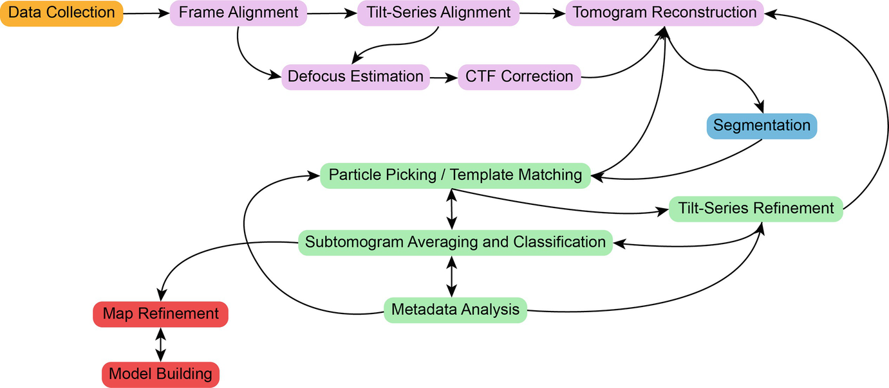

# Getting Started

In this practical, we will be going over data preprocessing, tomogram reconstruction, and subtomogram averaging using our TOMOMAN/STOPGAP pipeline.
A typical cryo-electron tomography (cryo-ET) workflow is illustrated below.

## TOMOMAN

TOMOMAN, i.e. TOMOgram MANager, is a MATLAB package for managing the various preprocessing steps for taking raw data to reconstructed tomograms.
TOMOMAN mainly acts as a set of wrapper scripts for external packages, managing the input and outputs of each external module to form a cohesive pipeline.
Preprocessing metadata is collected into the TOMOMAN "tomolist" (default name `tomolist.mat`) while output is written to a plain-text log file (default name: `tomoman.log`).
For more information about TOMOMAN, see [Khavnekar & Wan. _bioRxiv._ 2024.](https://www.biorxiv.org/content/10.1101/2024.05.02.589639v1)

## STOPGAP

_Add introduction to stopgap?_
For more information about STOPGAP, see [Wan et al. _Acta Crystallogr., Sect. D: Biol. Crystallogr._ 2024.](https://doi.org/10.1107/S205979832400295X)

## External Packages

During this tutorial we will be using a number of other software packages.
These include:

- MotionCor2 ([publication](https://doi.org/10.1038/nmeth.4193))
- AreTomo ([publication](https://doi.org/10.1016/j.yjsbx.2022.100068))
- IMOD ([publication](https://doi.org/10.1006/jsbi.1996.0013))
- CTFFIND4 ([publication](https://doi.org/10.1016/j.jsb.2015.08.008))
- Fourier3D ([code](https://github.com/turonova/Fourier3D))
- NovaCTF ([publication](https://doi.org/10.1016/j.jsb.2017.07.007), [code](https://github.com/turonova/novaCTF))
- UCSF Chimera ([homepage](https://www.rbvi.ucsf.edu/chimera/)) with [Pick Particle](https://www.biochem.mpg.de/7940000/Pick-Particle) and [Place Object](https://www.biochem.mpg.de/7939908/Place-Object) plugins
