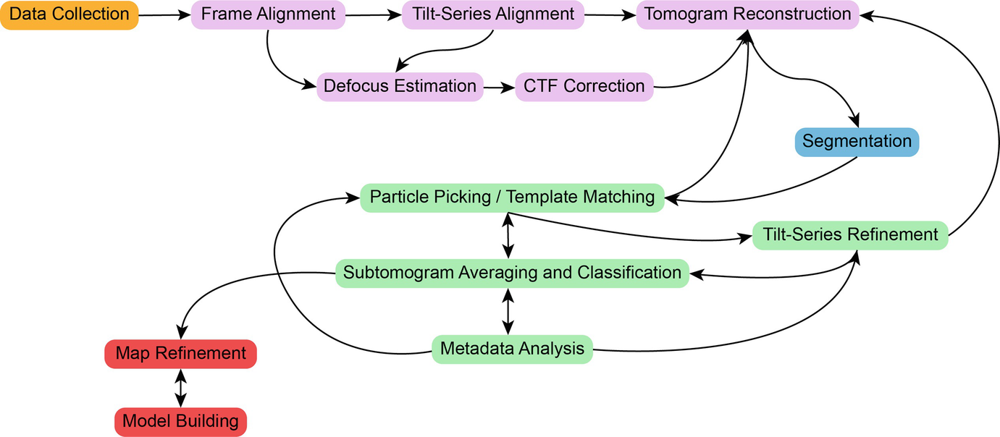

# Subtomogram Averaging

This website hosts tutorials for subtomogram averaging using TOMOMAN and STOPGAP.

## Workflow

We will disucss data preprocessing, tomogram reconstruction, and subtomogram averaging using our TOMOMAN/STOPGAP pipeline.
A typical cryo-electron tomography (cryo-ET) workflow is illustrated below.

## TOMOMAN

TOMOMAN, i.e. TOMOgram MANager, is a MATLAB package for managing the various preprocessing steps for taking raw data to reconstructed tomograms.
TOMOMAN mainly acts as a set of wrapper scripts for external packages, managing the input and outputs of each external module to form a cohesive pipeline.
Preprocessing metadata is collected into the TOMOMAN "tomolist" (default name `tomolist.mat`) while output is written to a plain-text log file (default name: `tomoman.log`).
For more information about TOMOMAN, see [Khavnekar & Wan. _bioRxiv._ 2024.](https://www.biorxiv.org/content/10.1101/2024.05.02.589639v1)

## STOPGAP

STOPGAP is a real-space correlation-based package for template matching, subtomogram alignment and averaging, and classification. 
STOPGAP's main goal is to provide users a set of useful subtomogram averaging algorithms while making virtually all parameters readily accesible. 
This is based around the notion that every biological problem has unqiue requirements on cryo-ET, and that the user is best suited to determining these requirements.
It is an open-source package written in MATLAB, and is primarily designed to run on CPUs in high-performance computing (HPC) environments. 
For more information about STOPGAP, see [Wan et al. _Acta Crystallogr., Sect. D: Biol. Crystallogr._ 2024.](https://doi.org/10.1107/S205979832400295X)

## Courses

Previous workshops using this tutorial:

* 202406 [University of Michigan Workshop](https://www.lsi.umich.edu/events/2024-06/2024-cryo-electron-tomography-data-processing-workshop)
* 202208 [EMBO Practical Course](https://www.embl.org/about/info/course-and-conference-office/events/cry22-01/) ([Archived tutorial](https://github.com/sagarbiophysics/Subtomo-tutorials/tree/main))
